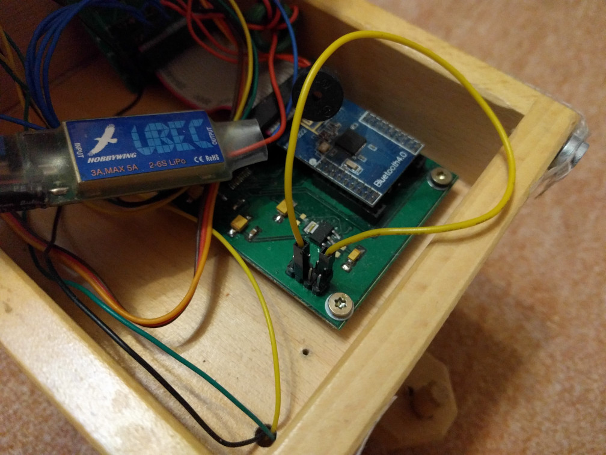
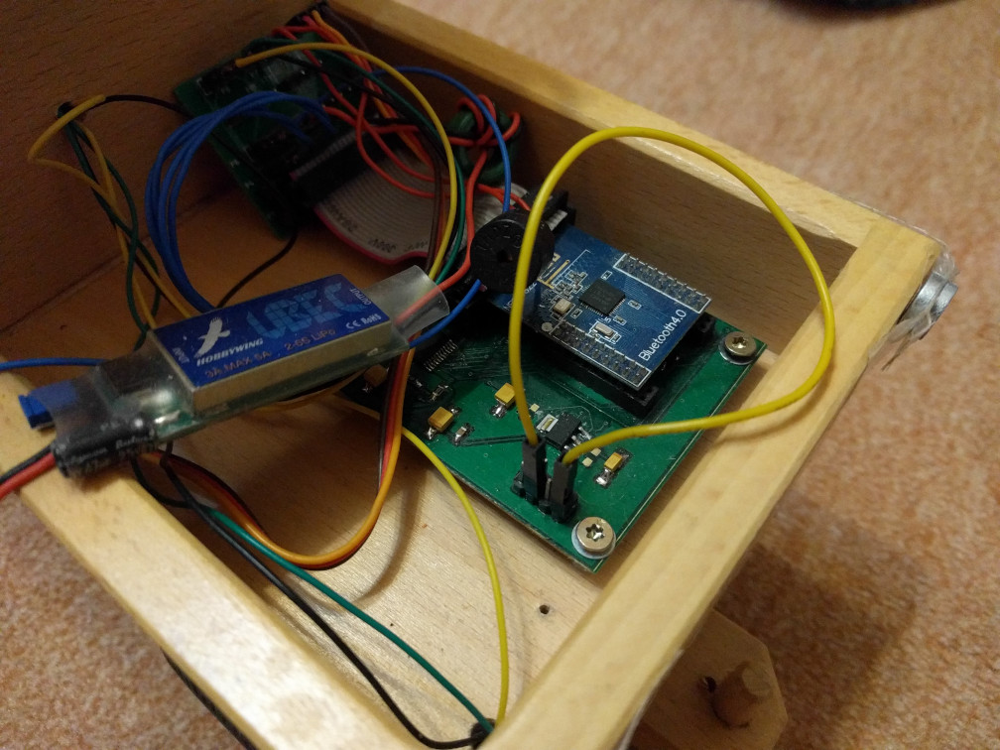
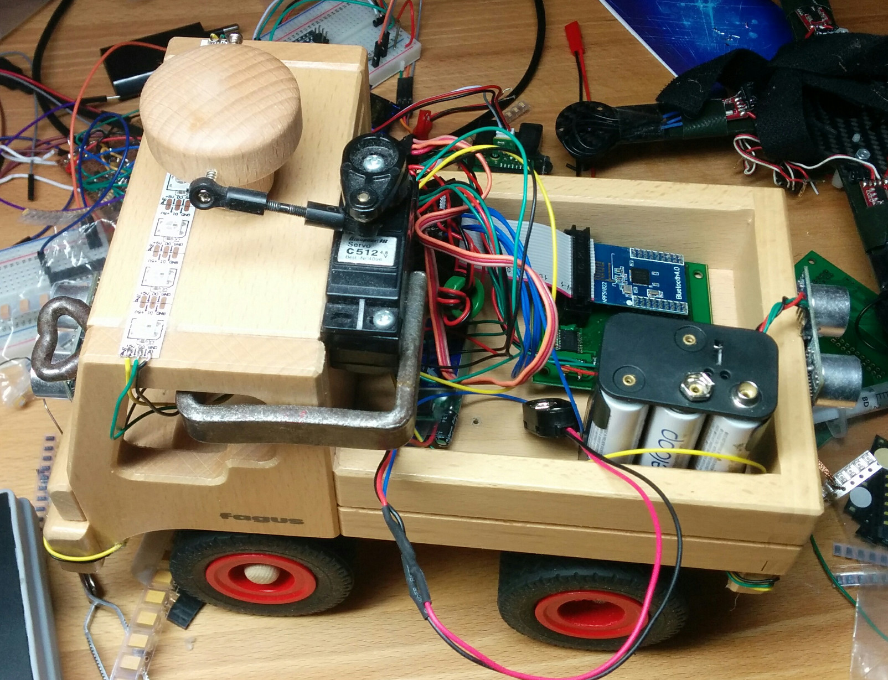
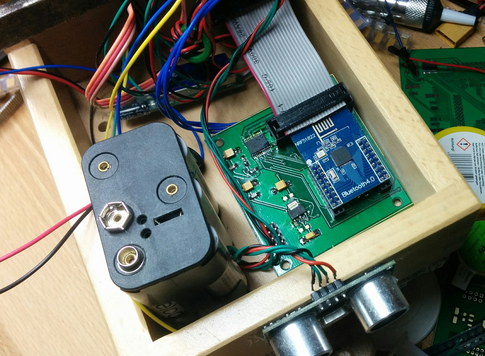

# Compiling
* Place NRF5 SDK 12.1 next to this directory (`../nRF5_SDK_12.1.0_0d23e2a/`)
* Set compiler path in `../nRF5_SDK_12.1.0_0d23e2a/components/toolchain/gcc/Makefile.posix`
* Install python 2.7 and pip install nrfutil (and maybe add `~/.local/bin` to `$PATH`)
* Install make
* Install gcc-arm-none-eabi
* Execute make

# BLE firmware update
1. Install NRF Connect
2. Connect DFU boot pins
3. Connect to DFUTARG
4. Select DFU

# Boot pin configuration
1. BLE DFU mode

2. RC mode

# Pictures

